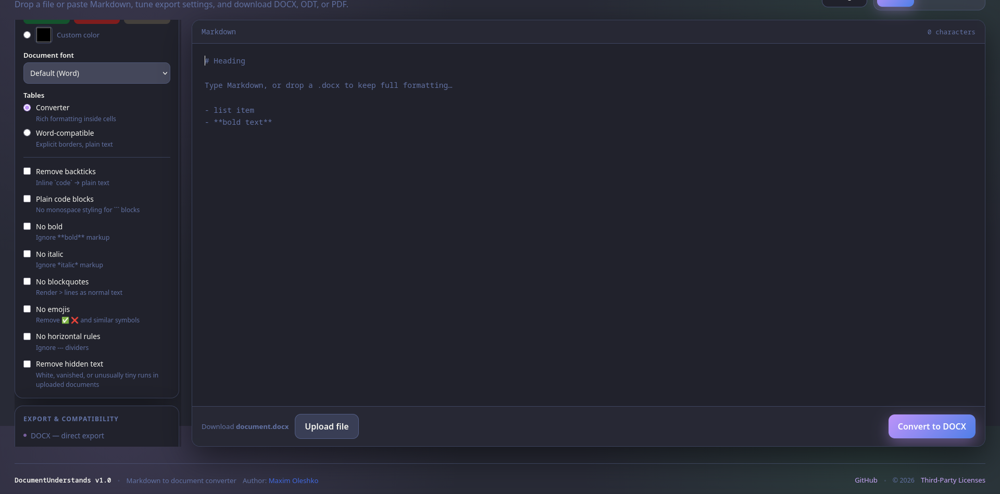
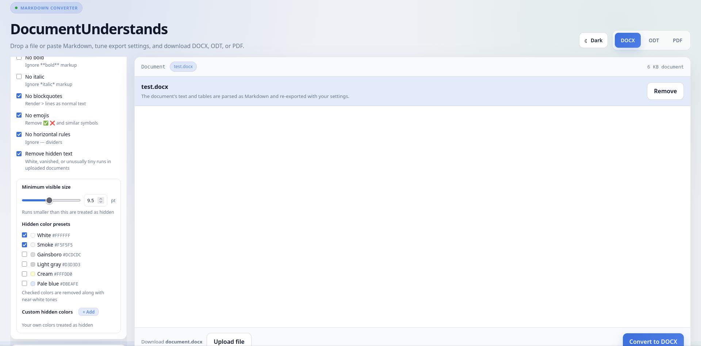

# DocumentUnderstands v1.0

### Main
**DocumentUnderstands** is an application on **Python (Flask)**, which used to convert Markdown syntax into documents,
supporting `.docx`, `.odt`, `.pdf` extensions.

### Screenshots

<p align="center">
  
  <br><em>Dark theme</em>
</p>

<p align="center">
  
  <br><em>Light theme</em>
</p>

---

## Features

#### Input Methods
- **Paste Markdown** directly into the editor
- **Upload files**: `.md`, `.markdown`, `.txt` (loaded into editor), `.docx` (extracted as Markdown source)
- **Drag & Drop** support for all supported file types

#### Export Settings
- **Text colors**: Preset colors (black, gray, navy, green, burgundy, brown) or custom HEX color
- **Table text color**: Separate color control for table cells
- **Font family**: Choose from Times New Roman, Arial, Calibri, Georgia, Cambria, Verdana, Garamond, or Word default
- **Table mode**:
  - *Converter*: Rich formatting inside cells (bold, italic, links, etc.)
  - *Word-compatible*: Explicit borders, plain text for maximum compatibility
- **Formatting options**:
  - Remove backticks (inline `code` → plain text)
  - Plain code blocks (no monospace styling)
  - Strip bold/italic formatting
  - Remove blockquotes
  - Remove emojis (✅ ❌ and similar symbols)
  - Remove horizontal rules
  - Remove hidden text (white, vanished, or tiny runs in uploaded documents)

#### Supported Export Formats
- **DOCX**: Direct export using `python-docx`
- **ODT**: Converted via LibreOffice (requires LibreOffice installed)
- **PDF**: Converted via LibreOffice (requires LibreOffice installed)

#### User Interface
- **Dark/Light theme** with automatic persistence
- **Responsive design** for desktop
- **Real-time character count**
- **File preview** for uploaded documents
- **Keyboard shortcut**: `Ctrl+Enter` (or `Cmd+Enter` on macOS) to submit

#### Technical Features
- **Graceful shutdown**: Browser tabs close automatically when the application stops
- **Cross-platform**: Works on Windows, Linux, and macOS
- **Single executable**: No Python installation required for end users
- **Large file support**: Up to 32 MB uploads

---

## Usage
Run the executable file, then the web application will launch in the browser. **On Linux make sure that you are
launching the application via terminal.**

**Verifying SHA256 steps:**

*Linux / macOS:*
```
cd ~/Downloads
sha256sum -c SHA256SUMS.txt
```

**Output should be:** OK

*Windows:*

Syntax should be the same as Linux, but you need **Git Bash** or **WSL** on your computer to do it.
```
sha256sum -c SHA256SUMS.txt
```

> **Windows users:** release executables are not code-signed.
> If SmartScreen shows a warning, click *More info → Run anyway*.
> Verify file integrity with `SHA256SUMS.txt` attached to each release.

---

## Build
For assembly, you can use ***PyInstaller*** following this:

#### Linux / macOS
```
pyinstaller --onefile --console \
    --hidden-import engineio.async_drivers.threading \
    --hidden-import socketio \
    --collect-data docx \
    --add-data "templates:templates" \
    --add-data "static:static" \
    --add-data "LICENSES.txt:." \
    --name DocumentUnderstands app.py
```

#### Windows
```
pyinstaller --onefile --console \
    --hidden-import engineio.async_drivers.threading \
    --hidden-import socketio \
    --collect-data docx \
    --add-data "templates;templates" \
    --add-data "static;static" \
    --add-data "LICENSES.txt;." \
    --name DocumentUnderstands app.py
```

**NOTICE**: You should use some important flags.

| Flag              | Description                                                                                                                                                                                              |
|-------------------|----------------------------------------------------------------------------------------------------------------------------------------------------------------------------------------------------------|
| `--console`       | Opens a terminal window. Required for graceful shutdown and closing browser tabs when the application stops.                                                                                             |
| `--add-data`      | Bundles the `templates/` and `static/` folders and the `LICENSES.txt` into the executable. Flask needs these to render HTML and serve static files. Use `:` separator on Linux/macOS and `;` on Windows. |
| `--hidden-import` | Forces PyInstaller to include `socketio` and `engineio.async_drivers.threading` modules, which are loaded dynamically at runtime and would otherwise be missed.                                          |

---

## Installation (for development)

1. **Clone the repository**:
```bash
git clone https://github.com/MaximOleshko/DocumentUnderstands
cd DocumentUnderstands
```

2. **Create virtual environment**:
```bash
python -m venv venv
source venv/bin/activate  # Linux/macOS
venv\Scripts\activate     # Windows
```

3. **Install dependencies**:
```bash
pip install -r requirements.txt
```

4. **Install LibreOffice** (required for ODT/PDF export):
   - **Ubuntu/Debian**: `sudo apt install libreoffice`
   - **Fedora**: `sudo dnf install libreoffice`
   - **macOS**: `brew install --cask libreoffice`
   - **Windows**: Download from [libreoffice.org](https://www.libreoffice.org/download/)

5. **Run the application**:
```bash
python app.py
```

The browser will open automatically at `http://127.0.0.1:5000`.

---

## Project Structure

```
DocumentUnderstands/
├── converts/                  # Markdown -> AST
│   ├── __init__.py
│   ├── ast_nodes.py           # dataclass-nodes AST
│   └── markdown_to_ast.py     # Markdown parser
├── exports/                   # AST -> DOCX / ODT / PDF
│   ├── __init__.py
│   ├── document_export.py     # bridge to LibreOffice
│   ├── docx_spaces.py         # keeping spaces in runs
│   ├── export_to_docx.py      # render AST -> DOCX
│   ├── settings.py            # export settings and presets
│   └── text_utils.py          # removing emojis
├── imports/                   # DOCX -> Markdown
│   ├── document_processor.py  # extract + hidden text
│   └── file_reader.py         # reading files
├── static/
│   ├── css/
│   │   └── main.css           # Styles and themes (Dark / light)
│   ├── js/
│   │   └── app.js             # UI logic
│   └── logo-128px.png
├── templates/
│   └── index.html             # Web-UI
├── docs/
│   └── screenshots/           # Screens for README
│       ├── Dark-theme-DocumentUnderstands.png
│       └── Light-theme-DocumentUnderstands.png
├── .gitignore
├── app.py                     # Entry point
├── LICENSE                    # MIT License
├── LICENSES.txt               # All licenses for the application.
├── README.md
└── requirements.txt
```

---

## Requirements

- **Python**: 3.12 or higher (for development)
- **LibreOffice**: Required for ODT and PDF export
- **Supported browsers**: Chrome, Firefox, Edge, Safari (modern versions)

---

## Dependencies

- `flask`: Web framework
- `flask-socketio`: WebSocket support for browser tab management
- `python-docx`: DOCX file manipulation

---

## Known Limitations

1. **Nested lists**: Current parser does not support nested lists (e.g., lists inside lists)
2. **Complex Markdown**: Some advanced Markdown features (footnotes, definition lists, task lists) are not supported
3. **Image support**: Images must be URLs (not local files) and require internet connection
4. **LibreOffice dependency**: ODT and PDF export require LibreOffice to be installed on the system
5. **Browser security**: Some browsers may prevent automatic tab closing after user interaction (form submission). In this case, a "Server stopped" message is displayed instead.

---

## License

This project is licensed under the MIT License - see the [LICENSE](LICENSE) file.

This product bundles third-party components (Flask, python-docx,
flask-socketio and others). Their copyrights and license texts are listed
in [THIRD-PARTY-LICENSES.md](THIRD-PARTY-LICENSES.md).

---

## Contact

Maxim Oleshko

Email: maksimoleshko05@gmail.com